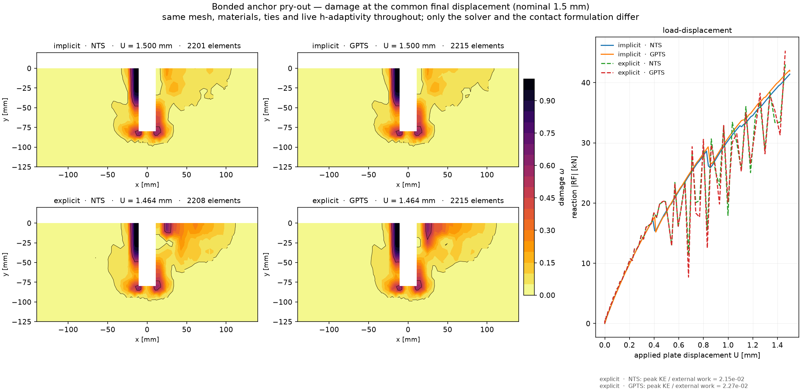

# Bonded anchor pry-out — a four-variant template

A bonded M20 anchor, embedded 80 mm in a concrete slab and loaded sideways through a fixture plate
until the concrete breaks out. The same model is set up **four times** — implicit and explicit, each
with two contact formulations — so you can see what changes and what does not.

|  | node-to-surface contact | Gauss-point-to-segment contact |
|---|---|---|
| **implicit static** | `pryout_implicit_nts.inp` | `pryout_implicit_gpts.inp` |
| **explicit dynamic** | `pryout_explicit_nts.inp` | `pryout_explicit_gpts.inp` |

All four ramp the plate to **the same 1.5 mm**, so they are comparable at equal load rather than at
equal time.

```bash
edelweissfe pryout_implicit_nts.inp        # see the table below for timings
python plot_damage_comparison.py           # once all four have run
```

Measured on 16 threads, two variants at a time, on a 36-core machine:

| variant | wall time | refinement occasions | final concrete elements | final U |
|---|---|---|---|---|
| `implicit_nts` | ~26 min | 47 | 2201 | 1.500 mm |
| `implicit_gpts` | ~33 min | 51 | 2215 | 1.500 mm |
| `explicit_nts` | ~40 min | 12 | 2208 | 1.464 mm |
| `explicit_gpts` | ~30 min | 12 | 2215 | 1.464 mm |

All four reach the same refined mesh size by different routes. The explicit runs stop at 1.464 mm
rather than 1.500 because the last *recorded* output tick falls just short of the final increment —
the ramp itself completes.

Run each in its own directory (the `*include` paths are relative to the working directory), and set
`OMP_NUM_THREADS` and `PYTHON_GIL=0` for the threaded element loop.

## What it exercises

Most of the features that make a real analysis awkward, in one model of a manageable size:

- **gradient-enhanced damage** (Marmot `gcdp` on `GC3D20R`) — softening concrete with an internal
  length, so the response is mesh-objective rather than localising into one element band
- **five tie constraints** — the fastener stack and the full bonded length, condensed out as
  multi-point constraints
- **two penalty contacts** — plate on concrete, and the shaft in the plate's clearance hole; these
  are the only genuinely unilateral interfaces
- **live h-adaptivity** — the mesh refines *during* the run wherever damage has started, roughly 20
  times, taking the concrete from 1634 to about 3000 elements. Ties and contacts are rebuilt around
  the new mesh each time.
- **both solvers on the same model** — the same mesh, materials, ties and contacts, driven to the
  same displacement by a Newton solve and by central differences

## How the files fit together

A variant is only the lines that make it that variant; everything shared is included once.

```
figures/damage_comparison.png     what plot_damage_comparison.py produces
pryout_<solver>_<contact>.inp     six includes and a *job — nothing else
├── materials_implicit.inc  or  materials_explicit.inc
├── model.inc                     mesh, sections, 14 interface surfaces, 5 ties
├── contact_nts.inc         or  contact_gpts.inc
├── adaptivity.inc                the live refinement marker
├── outputs.inc                   field outputs, Ensight, monitor
└── steps_implicit.inc      or  steps_explicit.inc     solver + steps + boundary conditions
```

Boundary conditions live in the step files rather than in one shared include, because `>>` option
lines cannot open an `*include` — the parser loses the enclosing keyword's context. A whole `*step`
block in an include is fine, which is why the seven Dirichlet conditions are written twice (once per
solver) instead of eight times.

To try a different contact formulation, change one include line. Nothing else about the model moves.



## Reading the two solvers against each other

They are the same problem, but an explicit integrator is not a drop-in replacement, and three of the
differences are consequences rather than choices. Each is argued where it is set:

| | implicit | explicit | why |
|---|---|---|---|
| densities | omitted | required, **×100 mass scaling** | a static solve builds no mass matrix; the explicit stable increment goes with 1/√ρ, and the scaling is what makes the run reach 1.5 mm in comparable time |
| Duvaut-Lions viscosity | `1e-6` | **`0`** | it is a relaxation time. At dT ≈ 3.4e-7 s nothing relaxes per increment, and a non-zero value makes the concrete respond nearly elastically — a run that completes, looks plausible, and shows no softening |
| AMR marker | damage | damage | deliberately the same, so the comparison is not confounded. A stress marker is defensible implicitly but ratchets towards refining everything under explicit integration |
| courant number | — | **0.1**, not the 0.8 default | `l/c` is a linear-element formula; a quadratic element's highest eigenfrequency is several times what it predicts. At 0.8 this model returns a reaction 26× too small **and does not fail** |

The mass scaling is the one to watch. It buys speed by making the structure heavier, which works
*against* quasi-staticity, so `plot_damage_comparison.py` integrates the reaction against the
displacement and reports the kinetic energy as a fraction of that external work.

**On this example that ratio is ~2.2 %**, and the load-displacement panel shows what that looks like:
the explicit reaction *rings* around the implicit curves by roughly ±30 % once damage and contact are
both active, while tracking their mean. The damage fields still agree closely, which is the useful
part — but if you need a smooth reaction history rather than a correct mean, reduce the mass scaling
and lengthen the ramp, at a proportional cost in increments. That trade-off, not the fact that the
run completed, is what says whether an explicit result is usable as a static one.

## The mesh is coarse on purpose

`l/h ≈ 0.12` near the anchor, against 0.55 on the production mesh in `examples/AnchorPryOut`, which
is itself not converged. The damage field is under-resolved by construction: this example exists to
be **runnable in half an hour**, not to predict a breakout cone. Treat the contours as a
demonstration of the machinery.

To make it finer, regenerate the mesh with a smaller `PRYOUT_COARSEN` — see the header of
`model.inc` for the command and for `check_mesh.py`, which verifies a regenerated mesh before you
build on it.

## Where to take it next

- **restart** — add `*output, type=restart` and resume with `*restart, readFrom=...`. Restart is
  faithful across live refinement here: on this model a resumed run agrees with a continuous one to
  ~2e-15, against a no-restart control pair at ~2.2e-15.
- **a production-sized model** — `examples/AnchorPryOut` is the same physics at 280 k dof, with the
  `blockamg` linear-solver settings that make that size tractable
- **initial-only refinement** — if you would rather not have refinement events land in an already
  damaged field, mark a pry-out-cone-shaped element set once with `initialOnly=True` instead
